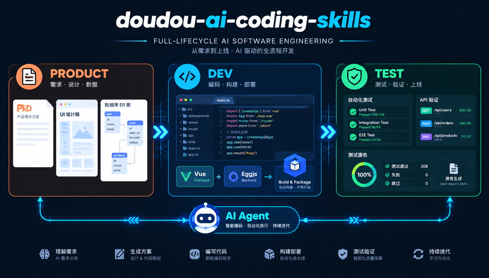

<h1 align="center">doudou-ai-coding-skills</h1>

<p align="center">
  <b>简体中文</b> | <a href="README_EN.md">English</a>
</p>

<p align="center">
  <a href="https://gitee.com/undsky/doudou-ai-coding">doudou-ai-coding</a> 配套的 Agent Skills 仓库。<br>
  提供从产品需求分析、原型、数据库设计、开发、测试、部署的全流程 AI 编程支持。
</p>

<p align="center">
  
</p>

---

## 📑 目录导航

- [📦 技能概览](#-技能概览)
- [📥 安装指南](#-安装指南)
- [📖 使用指南](#-使用指南)
  - [doudou-product（产品）](#doudou-product产品)
  - [doudou-dev（开发）](#doudou-dev开发)
  - [doudou-test（测试）](#doudou-test测试)
- [💬 社区与交流](#-社区与交流)
- [📄 许可证](#-许可证)

---

## 📦 技能概览

| 技能             | 用途                                                                                                     |
| ---------------- | -------------------------------------------------------------------------------------------------------- |
| `doudou-dev`     | 前后端、移动端（`doudou-eggjs`、`doudou-vue3`、`doudou-uniapp`）的开发调试（`dev`）与生产打包（`build`） |
| `doudou-product` | 根据需求资料或参考项目链接，输出产品需求文档、设计交付说明、数据库表结构、研发实现说明、测试验收用例     |
| `doudou-test`    | 已获授权的 Web 应用黑盒/白盒测试，输出 Markdown 测试报告                                                 |

---

## 📥 安装指南

本项目为 https://github.com/undsky/doudou-ai-coding 提供产品、开发、测试全流程的 AI 支持（支持 Antigravity、Claude Code、OpenCode 等平台）。

```bash
npx skills add undsky/doudou-ai-coding-skills --yes
```

---

## 📖 使用指南

### doudou-product（产品）

```
/doudou-product
```

配合 **[doudou-llm-wiki-skill](https://github.com/undsky/doudou-llm-wiki-skill)** 生成产品需求文档、设计交付说明、数据库表结构、研发实现说明、测试验收用例。

### doudou-dev（开发）

- **开发调试**：
  ```
  /doudou-dev
  ```
  关键词：“启动项目”、“调试后端”、“运行前端”
- **生产打包**：
  ```
  /doudou-dev build
  ```
  关键词：“打包项目”、“构建前后端”、“生成生产包”

### doudou-test（测试）

- **Web 管理端（`doudou-vue3`）**：
  ```
  /doudou-test http://localhost:8001
  ```
  关键词：“测试前端”、“测试管理端”、“测试Web端”
- **后端服务与接口（`doudou-eggjs`）**：
  ```
  /doudou-test http://localhost:7001
  ```
  关键词：“测试后端”、“测试接口”、“测试API”
- **移动端（`doudou-uniapp`）**：
  ```
  /doudou-test http://localhost:9090
  ```
  关键词：“测试移动端”、“测试H5”

---

## 💬 社区与交流

| 公众号                                       | QQ群（1095058701）                            |
| -------------------------------------------- | --------------------------------------------- |
|  |  |

---

## 📄 许可证

本项目采用 [CC BY-NC 4.0](LICENSE) 许可证。

- 个人使用、学习、研究与非商业项目可以直接使用。
- 公开发布衍生作品时，请注明来源。
- 商业用途需要单独授权，请联系作者。
