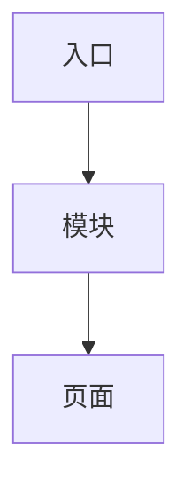
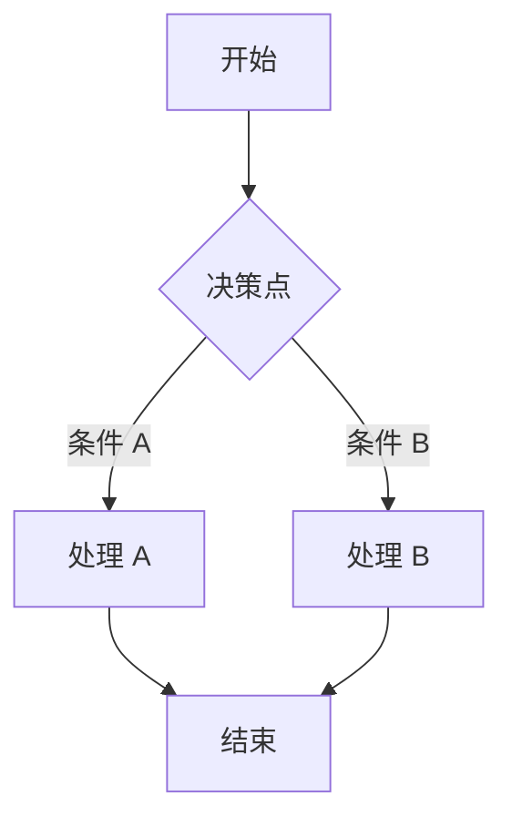
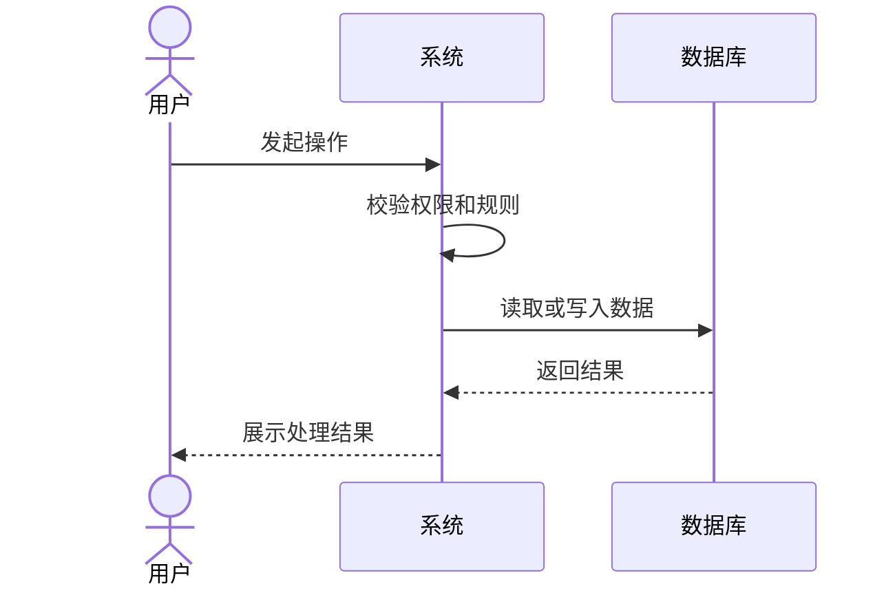
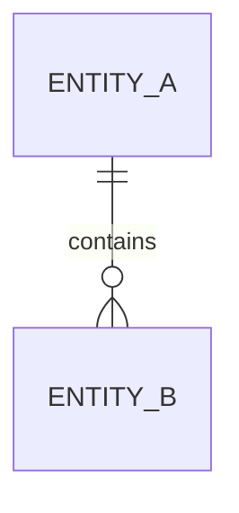

# 产品设计

将需求资料整理为可评审、可实现的产品设计。交付物需要让产品、设计、研发和测试都能据此对齐范围、规则、流程与数据模型。

## 资料来源与执行路径

资料可以来自本地需求目录、一个可访问的参考项目链接，或两者结合。先根据用户已提供的信息选择路径。

- **两者均未指定**：默认从项目根目录下的 `resources/any2ai/` 读取需求资料，按“先收集资料”处理；该目录通常存放已转为文本的需求资料。读取前先告知用户将从该目录取材，不要静默改用其他目录。
- **仅本地目录**：按“先收集资料”读取资料，完成既有五份产品设计交付物。
- **仅参考链接**：按“参考项目链接分析”使用 `chrome-devtools-mcp` 浏览、交互并记录证据，先输出带时间戳的 `参考项目分析-<年月日时分秒>.md`；该报告是后续产品设计的事实来源。若用户要求基于参考项目继续设计，再确认数据库与命名规范并输出其余交付物。
- **本地目录 + 参考链接**：本地资料用于确认业务目标、约束与实现现状，参考项目用于补足体验、功能、流程和交互细节。明确区分“需求已确认”“参考项目观察”“设计推断”三类信息，不能把参考项目的行为误写成用户已确认需求。

参考链接应为用户有权访问、可公开浏览或已在当前浏览器会话中完成登录的网站、Web 应用、后台系统、移动端 H5 或在线原型。不得绕过登录、付费、访问控制或其他安全限制；遇到限制时，记录访问范围和缺口，并请用户提供授权访问、截图或补充资料。

## 参考项目链接分析

当用户提供参考项目链接，或要求分析某个网站/系统/页面/竞品时，使用 `chrome-devtools-mcp` 进行真实浏览和交互分析，而不是仅根据 URL、页面标题或视觉截图推断。

### 分析前确认

1. 记录参考链接、分析目标、可用账号/角色、分析边界和已知重点页面；若用户未说明重点，以核心用户路径、主要功能模块、信息架构、权限与异常状态为默认范围。
2. 若登录、验证码、测试数据、付费或高风险操作会阻塞分析，先向用户索取必要的授权、测试账号或安全的测试数据；不要自行注册、支付、删除数据、提交真实业务数据或触发不可逆操作。
3. 对会写入、发送、删除、发布或影响外部系统的动作，只分析其入口、字段、校验、确认提示和结果反馈；除非用户明确授权且该操作可安全撤销，否则停在最终确认前。

### 使用 chrome-devtools-mcp 的深入分析步骤

1. 用 `chrome-devtools-mcp` 打开链接，获取当前页面快照；记录页面标题、地址、首屏信息架构、全局导航、角色线索和可见功能入口。
2. 按用户主任务建立页面地图：从首页或目标入口出发，逐层打开核心模块、列表、详情、表单、筛选、设置、帮助与权限相关页面。每次页面跳转后重新获取最新快照，避免使用失效元素标识。
3. 对每个核心流程进行最小必要交互：填写可安全使用的演示数据、切换筛选项、展开/收起模块、分页、排序、查看详情、触发前端校验、取消操作、返回上一步。记录触发条件、页面变化、字段规则、反馈信息与状态变化。
4. 观察并记录默认、加载、空数据、校验失败、操作成功、操作失败、无权限、禁用、重复提交、网络异常和确认弹窗等状态；无法安全触发的状态必须标记为“未验证”，不能臆造。
5. 使用浏览器控制台和网络面板辅助确认前端可观察到的行为：页面资源、公开接口请求的 URL/方法/参数结构、响应字段、错误码、路由变化、客户端校验和状态管理线索。只记录产品和实现分析必需的最小信息；不得导出或披露令牌、Cookie、密码、个人信息或其他敏感数据。
6. 对复杂流程、关键页面或重要状态，保存页面截图或结构化观察笔记作为证据。截图只用于支撑分析，不应在报告中包含敏感数据；必要时对账号、手机号、邮箱、订单号等信息脱敏。
7. 将每项结论回链到可复核证据：页面路径、操作步骤、可见文案、网络/控制台观察或截图编号。把无法从界面确认的后台规则、数据模型和权限逻辑列为推断或待确认项。

### 分析深度与覆盖要求

参考项目分析至少覆盖以下内容；只覆盖实际可访问范围，并明确未覆盖原因：

- **产品定位与目标用户**：从页面语言、入口、角色、任务和功能组合中归纳，并标注证据与置信度。
- **信息架构**：导航层级、模块边界、入口、页面关系、跨页面返回路径与全局能力。
- **核心功能清单**：每项功能的目标、适用角色、入口、输入、处理规则、输出、相关页面和依赖。
- **核心用户流程**：至少包含主流程、重要分支、取消/返回、失败或校验异常；适用时用 Mermaid 图表达。
- **页面与交互规格**：布局分区、组件、字段、必填与格式规则、筛选/排序/分页、反馈文案、弹窗、空状态与加载状态。
- **状态与权限**：可观察到的对象状态、状态转换、角色差异、可见/可操作边界、禁用与无权限反馈。
- **前端可观察实现线索**：路由结构、接口边界、公开请求模式、客户端校验、性能与可用性观察；这些内容不得替代对后端实现的未经验证断言。
- **可借鉴点与风险**：值得复用的业务设计、交互模式和信息组织；同时说明不宜直接复刻的部分、合规/版权/隐私风险、技术依赖与需要重新设计的差异。

### `参考项目分析-<年月日时分秒>.md` 固定结构

当分析了参考项目链接时，在用户指定输出目录中生成 `参考项目分析-<年月日时分秒>.md`。报告使用中文 Markdown，并至少使用以下结构：

````markdown
# <参考项目名称> 参考项目分析

## 1. 分析信息

| 项目       | 内容                                 |
| ---------- | ------------------------------------ |
| 参考链接   | <URL>                                |
| 分析日期   | <YYYY-MM-DD>                         |
| 可访问范围 | <公开页面/已登录角色/受限范围>       |
| 分析目标   | <用户目标>                           |
| 证据说明   | <页面路径、截图或网络观察的使用方式> |

## 2. 执行摘要

- 产品定位与主要价值：
- 核心用户与角色：
- 最重要的功能/流程：
- 可借鉴重点：
- 主要限制与待确认项：

## 3. 覆盖范围与方法

### 3.1 已分析页面与路径

| 编号 | 页面/模块 | URL 或路由 | 访问方式 | 已验证内容 | 证据 |
| ---- | --------- | ---------- | -------- | ---------- | ---- |

### 3.2 未覆盖范围

| 范围 | 原因 | 对结论的影响 | 建议补充方式 |
| ---- | ---- | ------------ | ------------ |

## 4. 产品定位、用户与角色

## 5. 信息架构与导航



## 6. 功能模块分析

### 6.1 <功能模块名称>

| 项目           | 内容         |
| -------------- | ------------ |
| 功能目标       |              |
| 适用角色       |              |
| 入口与前置条件 |              |
| 输入与关键字段 |              |
| 核心交互/规则  |              |
| 输出与反馈     |              |
| 页面状态与异常 |              |
| 观察证据       |              |
| 置信度         | 高 / 中 / 低 |

## 7. 核心用户流程与状态

包含主流程、关键分支、异常/取消路径；适用时补充 `sequenceDiagram`、`stateDiagram-v2` 或流程图。

## 8. 页面与交互观察

| 页面 | 布局/模块 | 字段与校验 | 操作与反馈 | 空/加载/异常状态 | 可借鉴点 |
| ---- | --------- | ---------- | ---------- | ---------------- | -------- |

## 9. 前端可观察实现线索

仅记录从浏览器可观察到的路由、公开请求模式、响应结构、客户端校验、性能和兼容性现象；敏感信息须脱敏。

## 10. 可借鉴设计与差异化建议

## 11. 风险、设计推断与待确认项

| 类型       | 内容 | 依据/影响 | 建议 |
| ---------- | ---- | --------- | ---- |
| 已确认观察 |      |           |      |
| 设计推断   |      |           |      |
| 待确认项   |      |           |      |
````

## 先收集资料

首次触发时，先判断用户是否已经提供了本地资料目录、参考项目链接或两者：

- 两者均未提供时，默认使用项目根目录下的 `resources/any2ai/` 作为资料目录，先列出其中的文件并告知用户取材位置，再按“提供本地目录时”的步骤读取。项目根从当前工作目录向上查找，遇到 `.agents` 或 `.claude` 即认作项目根。
- 默认目录不存在、为空或只有占位文件时，不要自行创建目录，也不要改用其他目录的文件，使用交互式问题询问：

  > `resources/any2ai/` 中没有可用的需求资料。请提供本次需求资料所在的目录路径，或提供需要分析的参考项目链接；也可以先把需求资料放入 `resources/any2ai/` 后再继续。

- 只提供参考链接且目标是分析/借鉴/梳理参考项目时，直接进入“参考项目链接分析”；不要为尚未要求的数据库 SQL 预先询问数据库类型或命名规范。
- 提供本地目录，或使用默认目录 `resources/any2ai/` 时：
  1. 列出其中的文件，优先阅读需求说明、现有 PRD、原型说明、接口文档、数据库 DDL、项目中的实体模型和相关业务代码。
  2. 识别资料格式与覆盖范围。对图片、PDF、表格或原型链接，尽可能读取其内容；无法读取时说明限制并请用户补充关键内容。`resources/any2ai/` 中的文件名带 `-年月日时分秒` 时间戳，同一来源可能存在多个版本；默认取时间戳最新的一份，并在汇报中说明所选版本。
  3. 梳理参与角色、目标用户、核心对象、主流程、异常流程、状态变化、权限边界、外部依赖和已有数据模型。
  4. 仅在缺少会实质改变产品方案的关键信息时提问。将无法确认但不阻塞产出的内容列为“待确认项”和“设计假设”，不要把假设写成既定事实。

当用户已在当前对话中明确给出资料来源和目标，无需重复提问。

## 再确认数据库类型

读完资料后、开始设计表结构前，使用交互式问题确认本次使用的数据库，三选一：

> 本次数据库表结构使用哪种数据库？MySQL / PostgreSQL / SQLite。

- 若资料或现有项目已能判断方言，把它作为推荐选项并说明依据，仍需用户确认。
- 用户已在当前对话中明确指定数据库类型时，不再重复提问。
- 确认结果写入产品需求文档的“数据库方言”一栏，并作为 SQL 文件的方言基准。

## 再确认命名规范

确认数据库类型后、开始设计表结构前，继续使用交互式问题确认表名和字段名的语言规范，二选一：

> 表名和字段名使用哪种命名规范？英文单词 / 汉语拼音。

- 所有新设计的业务表名必须使用 `biz_` 前缀，例如 `biz_orders`、`biz_dingdan`。
- 表名和字段名统一使用小写字母与下划线分隔，不使用大写字母、连字符或混合语言。
- 选择“英文单词”时，使用语义明确的英文单词或英文缩写；选择“汉语拼音”时，使用可读的汉语拼音，不使用中文字符。
- 用户已在当前对话中明确指定命名规范时，不再重复提问；确认结果写入产品需求文档的“设计假设”或“待确认项”，并作为 SQL 文件命名基准。

## 设计原则

- 以需求资料为事实来源；现有数据库、接口和代码属于约束，不能无理由推翻。
- 从用户目标和业务结果开始，再落到功能、规则、数据和实现边界。
- 区分业务规则、交互规则、数据规则与技术实现建议，避免把技术细节伪装成已确认的产品决策。
- 主流程应可闭环；关键异常、取消、失败、重复操作、权限不足、并发冲突和状态回退必须被考虑。
- 图必须表达真实的决策点、参与者和状态流转，而不是仅罗列页面或功能名称。
- 数据模型以规范化为默认，兼顾查询和审计需要；不要为尚未确认的需求过早拆分大量表。
- SQL 方言以用户确认的数据库类型为准（MySQL、PostgreSQL、SQLite 三者之一），并在文档中写明具体版本假设。

## 交付物

面向产品、设计、研发、测试分别输出可直接使用的交付物。根据资料来源和用户目标选择输出范围：

- 分析参考项目链接时，生成 `参考项目分析-<年月日时分秒>.md`。
- 进行完整产品设计时，生成以下五份带同一时间戳的产品设计交付物；若用户明确要求基于参考链接产出完整设计，则 `参考项目分析-<年月日时分秒>.md` 作为第六份交付物一并生成。
- 在用户指定的输出目录中创建文件；若用户没有指定输出目录，统一默认放在仓库根目录下的 `resources/product/` 中。创建前先告知用户将写入的位置。

1. `产品需求文档-<年月日时分秒>.md`：面向产品、设计、研发和测试的统一需求基线，包含背景目标、范围、角色权限、业务规则、业务流程、功能设计、数据模型、非功能要求、验收标准、设计假设和待确认项。
2. `设计交付说明-<年月日时分秒>.md`：面向设计，包含页面与模块清单、用户流程、信息架构、交互状态、页面状态与异常反馈、字段展示规则、权限差异、响应式或端差异要求，以及需要设计确认的交互问题。
3. `数据库表结构-<年月日时分秒>.sql`：面向研发，输出与产品文档一致、符合用户确认数据库方言和命名规范的可执行 DDL、必要的初始化数据、索引、约束和迁移说明。
4. `研发实现说明-<年月日时分秒>.md`：面向研发，包含功能模块拆分、接口与数据读写建议、状态流转、权限校验、异常处理、幂等与并发要求、外部依赖、日志审计、配置项和实现边界。
5. `测试验收用例-<年月日时分秒>.md`：面向测试，包含按功能和业务规则组织的验收用例、主流程、异常流程、边界条件、权限矩阵、状态流转、数据校验、兼容性和非功能测试要求。

完整产品设计的五份交付物必须使用同一套需求事实、业务规则、角色权限、状态定义和实体关系；若引用参考项目观察，应保留其“观察/推断”属性，直到用户确认纳入需求基线。

如果资料目录已有相同基础名称文件，先读取内容并保留有价值的既有信息；不要覆盖已有文件，使用带同一时间戳的新文件名。

### 设计交付说明

使用中文 Markdown，至少包含以下内容：

- 设计目标与适用端：本次设计解决的问题、覆盖的端和角色。
- 信息架构与页面清单：页面层级、入口、模块、核心组件和页面之间的关系。
- 用户流程与页面流程：从进入、操作、提交到完成或退出的完整路径，标明关键决策点。
- 交互与状态：默认、加载、空数据、成功、失败、校验、无权限、禁用、处理中、重复提交和网络异常等状态。
- 字段与展示规则：字段名称、格式、长度、必填性、脱敏、排序、筛选、分页和错误提示。
- 角色差异：不同角色可见、可编辑、可操作和不可操作的内容。
- 端与响应式要求：桌面端、移动端或其他端的布局、交互和兼容性差异。
- 设计待确认项：无法从资料确定且会影响交互或视觉方案的问题。

### 研发实现说明

使用中文 Markdown，至少包含以下内容：

- 模块拆分与实现边界。
- 接口输入输出、数据读写和事务边界建议。
- 状态机、权限校验、数据范围和操作幂等要求。
- 参数校验、异常处理、重复操作、并发冲突和失败回滚。
- 外部系统、消息、文件、缓存和配置依赖。
- 日志、审计、监控、告警、数据保留和安全要求。
- 数据库表与字段映射、索引、约束、迁移和初始化数据说明。
- 实现假设、技术风险和需要研发确认的事项。

### 测试验收用例

使用中文 Markdown，按测试场景组织用例，至少包含以下列：

| 编号 | 模块 | 场景 | 前置条件 | 测试数据 | 操作步骤 | 预期结果 | 优先级 |
| ---- | ---- | ---- | -------- | -------- | -------- | -------- | ------ |

测试内容必须覆盖：

- 主流程、分支流程和跨角色流程。
- 必填、格式、长度、范围、重复和非法数据校验。
- 空数据、加载、失败、超时、重试、取消和重复提交。
- 新增、编辑、删除、停用、启用和状态回退等生命周期操作。
- 角色权限、数据范围、越权访问和敏感数据展示。
- 数据库唯一性、关联关系、事务一致性和审计字段变化。
- 不同数据库方言、浏览器、设备、分辨率或接口版本的兼容性要求（适用时）。
- 性能、安全、可用性和可观测性验收指标（适用时）。

````markdown
# <产品或功能名称> 产品需求文档

## 1. 文档信息

| 项目       | 内容                                                        |
| ---------- | ----------------------------------------------------------- |
| 版本       | v1.0                                                        |
| 需求来源   | <资料文件或用户说明>                                        |
| 适用范围   | <端、角色、业务范围>                                        |
| 数据库方言 | <用户确认的数据库，如 MySQL 8.0 / PostgreSQL 16 / SQLite 3> |

## 2. 背景与目标

### 背景

### 用户问题

### 产品目标

### 非目标

### 成功指标

## 3. 用户与权限

| 角色 | 目标 | 权限范围 | 关键操作 |
| ---- | ---- | -------- | -------- |

## 4. 业务规则

| 编号 | 规则 | 触发条件 | 处理方式 | 影响范围 |
| ---- | ---- | -------- | -------- | -------- |

## 5. 业务流程


````

说明流程中的输入、输出、责任角色、关键状态和异常分支。

## 6. 功能设计

### 6.1 <功能模块>

- 功能目标：
- 使用角色：
- 前置条件：
- 主操作流程：
- 业务校验与边界：
- 成功结果与失败提示：
- 数据读写：

## 7. 功能流程



## 8. 数据模型说明

### 实体关系



| 表名 | 用途 | 主键 | 关联关系 | 核心字段 |
| ---- | ---- | ---- | -------- | -------- |

## 9. 非功能要求

涵盖性能、权限、安全、审计、数据保留、兼容性或可观测性中与需求相关的部分。

## 10. 验收标准

| 编号 | 场景 | 前置条件 | 操作 | 预期结果 |
| ---- | ---- | -------- | ---- | -------- |

## 11. 设计假设

## 12. 待确认项

````

流程图选择原则：

- 多角色协作或跨系统编排时，使用 `sequenceDiagram` 或带泳道语义的 `flowchart`。
- 状态机、订单、审批、任务等有明确生命周期的对象，补充 `stateDiagram-v2`。
- 业务步骤与用户操作并存时，在“业务流程”描述跨角色/跨系统过程，在“功能流程”描述一个功能的系统交互。
- Mermaid 代码必须可独立渲染，节点文字保持简洁；复杂流程拆分为多个图，避免一张图承载所有细节。

### 数据库表结构 SQL

输出可执行、可复核的 DDL，使用用户确认的数据库方言；若用户提供了现有 SQL、实体命名规则或迁移框架，严格沿用。若未提供项目规范，则使用本节定义的通用约定。

通用规则与用户提供的项目现状冲突时，优先保证现有项目可兼容、可迁移、可运行。

每张表须包含以下统一字段：

- `id`：自增主键。若用户提供的现有项目已有明确实体主键命名规范（例如 `dept_id`、`user_id`、`post_id` 等 `*_id` 字段），必须沿用该规范，并在设计说明中注明其是统一主键；新项目或无既有规范时使用 `id`。
- `status`：状态字段，使用与业务一致的默认值和状态说明。
- `create_by`：创建者。
- `create_time`：创建时间。
- `update_by`：更新者。
- `update_time`：更新时间。
- `remark`：备注。

以上字段即使业务暂时不直接使用，也必须保留；字段类型、默认值和注释按用户确认的数据库方言及项目现有规范确定。参考 SQL 中个别历史表未包含 `remark`，属于存量脚本兼容例外；新设计、新增表和重建表不得省略该字段。除上述统一字段外，再根据业务需要增加实体字段、关联字段、唯一约束、外键或逻辑关联说明。

其他表设计要求：

- 所有表名必须以 `biz_` 开头；无论选择英文单词还是汉语拼音，表名都使用 `biz_` + 小写名称 + 下划线分隔，例如 `biz_orders`、`biz_dingdan`。
- 表名和字段名统一使用小写字母与下划线分隔，不使用大写字母、连字符或混合语言。
- 明确的主键、必要的唯一约束与外键或逻辑关联说明。
- 适当的 `NOT NULL`、默认值、枚举/状态字段约束和检查约束（方言支持时）。
- 支撑高频查询、关联字段和业务唯一性的索引，避免无依据的冗余索引。
- 表和关键字段的业务含义注释，写法按方言选择。

统一字段按方言的参考写法（项目已有写法优先）：

| 字段          | 含义             | MySQL                                   | PostgreSQL                                    | SQLite                                |
| ------------- | ---------------- | --------------------------------------- | --------------------------------------------- | ------------------------------------- |
| `id`          | 自增主键         | `bigint(20) not null auto_increment`    | `bigserial not null` 或 `bigint generated always as identity` | `integer primary key autoincrement` |
| `status`      | 状态（0正常 1停用） | `char(1) default '0'`                  | `char(1) default '0'`                          | `text default '0'`                    |
| `create_by`   | 创建者           | `varchar(64) default ''`                | `varchar(64) default ''`                       | `text default ''`                     |
| `create_time` | 创建时间         | `datetime`                              | `timestamp`                                    | `text`                                |
| `update_by`   | 更新者           | `varchar(64) default ''`                | `varchar(64) default ''`                       | `text default ''`                     |
| `update_time` | 更新时间         | `datetime`                              | `timestamp`                                    | `text`                                |
| `remark`      | 备注             | `varchar(500) default null`             | `varchar(500) default null`                    | `text default null`                   |

### 三种参考 SQL 的具体约定

#### MySQL

- 关键字和表名沿用小写风格，所有新建业务表名必须以 `biz_` 开头；表名前使用 `drop table if exists`，多张表用 `-- ----------------------------` 和 `-- 1、xx表` 分段。
- 自增主键使用 `bigint(20) not null auto_increment`；若用户提供的现有项目使用实体前缀主键（如 `entity_id`），沿用该命名，不强制改名为 `id`。
- 业务字段使用 `varchar`、`char`、`int`、`tinyint`、`datetime` 等类型；时间由应用层通过 `sysdate()` 写入，参考表不统一设置时间默认值。
- 字段和表注释使用内联 `comment`；表尾使用 `engine=innodb`，需要时再按项目现有脚本补充字符集、排序规则或自增起始值。
- 唯一性可使用表级 `unique (field)` 或命名唯一键；高频查询字段使用 `key`，外键使用 `foreign key (...) references ...`。
- 初始化数据紧跟对应建表语句，使用 `insert into ... values (...)`；列较多时应优先显式列名，避免字段顺序变化导致数据错位。

#### PostgreSQL

- 关键字统一大写，所有新建业务表名必须以 `biz_` 开头；表名前使用 `DROP TABLE IF EXISTS`，表按编号分段。
- 自增主键使用 `BIGSERIAL NOT NULL`；初始化指定主键后，使用 `SELECT setval('<table>_<pk>_seq', <next-value>)` 修正序列，避免后续插入主键冲突。
- 整数使用 `integer` 或 `bigint`，时间使用参考项目的 `timestamp`；时间由应用层通过 `CURRENT_TIMESTAMP` 写入。
- 表和字段注释不能写 MySQL 的内联 `COMMENT`，必须在建表语句后使用 `COMMENT ON TABLE`、`COMMENT ON COLUMN`。
- 索引使用独立的 `CREATE INDEX` 语句；唯一约束可写在建表语句中或使用独立唯一索引。
- 初始化数据使用 `CURRENT_TIMESTAMP`；若显式插入自增主键，必须同步维护对应序列。

#### SQLite

- 关键字统一大写，所有新建业务表名必须以 `biz_` 开头；表名前使用 `DROP TABLE IF EXISTS`，表按编号分段。
- 自增主键使用 `INTEGER PRIMARY KEY AUTOINCREMENT`；若用户提供的现有项目使用实体前缀主键（如 `entity_id`），沿用该字段名。
- 业务字段主要使用 `TEXT`、`INTEGER`；时间字段使用 `TEXT`，初始化数据使用 `datetime('now','localtime')`。不要使用 MySQL 的 `datetime`、`auto_increment` 或 PostgreSQL 的 `bigserial`。
- SQLite 不支持 `COMMENT`，表和字段说明使用 SQL 行注释；参考脚本未统一设置 `PRAGMA foreign_keys = ON`，若设计包含外键，SQL 文件开头必须显式加入该语句并说明连接级别启用要求。
- 参考脚本的唯一约束可使用列级 `UNIQUE`；复杂索引使用独立 `CREATE INDEX` 语句。
- 初始化数据紧跟建表语句；SQLite 没有 PostgreSQL 序列，不需要 `setval`。

#### 跨方言禁止事项

- 不得把 MySQL 的 `ENGINE`、`AUTO_INCREMENT`、内联 `COMMENT`、`sysdate()` 带入 PostgreSQL 或 SQLite。
- 不得把 PostgreSQL 的 `BIGSERIAL`、`COMMENT ON`、`setval` 带入 MySQL 或 SQLite。
- 不得把 SQLite 的 `INTEGER PRIMARY KEY AUTOINCREMENT`、`datetime('now','localtime')` 当作 MySQL 或 PostgreSQL 的通用写法。
- 不得仅因为统一字段规范而删除用户提供的现有项目中的 `*_id` 主键命名、`del_flag` 软删除字段或现有数据初始化；应在设计文档中记录兼容关系。

`create_time` / `update_time` 由默认值、触发器还是应用层维护，应与用户提供的项目现状保持一致；若没有现状约束，则根据数据库方言和部署方式选择并在设计假设中说明。

若业务有软删除需求，在统一字段之外增加删除标志字段（参考项目使用 `del_flag char(1) default '0' comment '删除标志（0代表存在 2代表删除）'`；PostgreSQL 和 SQLite 按各自注释和类型规则改写）。

SQL 文件结构（以 MySQL 为例，其他方言按上表调整）：

```sql
-- 数据库方言：MySQL 8.0
-- 需求：<功能名称>
-- 说明：<迁移、依赖或执行注意事项>

-- ----------------------------
-- 1、示例实体表
-- ----------------------------
drop table if exists biz_example;
create table biz_example
(
  id            bigint(20)      not null auto_increment    comment '主键ID',
  name          varchar(128)    not null                   comment '名称',
  order_num     int(4)          default 0                  comment '显示顺序',
  status        char(1)         not null default '0'        comment '状态（0正常 1停用）',
  create_by     varchar(64)     default ''                 comment '创建者',
  create_time   datetime                                   comment '创建时间',
  update_by     varchar(64)     default ''                 comment '更新者',
  update_time   datetime                                   comment '更新时间',
  remark        varchar(500)    default null               comment '备注',
  primary key (id),
  unique key uk_biz_example_name (name),
  key idx_biz_example_status (status)
) engine=innodb comment = '示例实体表';
````

#### PostgreSQL 最小模板

```sql
DROP TABLE IF EXISTS biz_example;
CREATE TABLE biz_example (
  id          BIGSERIAL NOT NULL,
  name        varchar(128) NOT NULL,
  status      char(1) DEFAULT '0',
  create_by   varchar(64) DEFAULT '',
  create_time timestamp,
  update_by   varchar(64) DEFAULT '',
  update_time timestamp,
  remark      varchar(500) DEFAULT NULL,
  PRIMARY KEY (id)
);
COMMENT ON TABLE biz_example IS '示例实体表';
COMMENT ON COLUMN biz_example.id IS '主键ID';
COMMENT ON COLUMN biz_example.status IS '状态（0正常 1停用）';
COMMENT ON COLUMN biz_example.create_by IS '创建者';
COMMENT ON COLUMN biz_example.create_time IS '创建时间';
COMMENT ON COLUMN biz_example.update_by IS '更新者';
COMMENT ON COLUMN biz_example.update_time IS '更新时间';
COMMENT ON COLUMN biz_example.remark IS '备注';
```

#### SQLite 最小模板

```sql
PRAGMA foreign_keys = ON;

DROP TABLE IF EXISTS biz_example;
CREATE TABLE biz_example (
  id          INTEGER PRIMARY KEY AUTOINCREMENT,
  name        TEXT NOT NULL,
  status      TEXT DEFAULT '0',
  create_by   TEXT DEFAULT '',
  create_time TEXT,
  update_by   TEXT DEFAULT '',
  update_time TEXT,
  remark      TEXT DEFAULT NULL
);
```

MySQL、PostgreSQL、SQLite 必须分别使用对应方言模板，不得直接复制本节 MySQL 示例。

SQL 必须与文档中的实体、关系、状态和规则一致。为每个外键关系说明删除/更新策略；当项目不使用数据库外键时，通过索引和 SQL 注释表达逻辑关联。

## 输出前自检

完成后逐项检查：

1. 若存在参考项目链接，是否已使用 `chrome-devtools-mcp` 对实际可访问页面和核心流程进行浏览、交互与证据记录，而非仅依据链接或截图推断？
2. 若存在参考项目链接，`参考项目分析-<年月日时分秒>.md` 是否明确区分已验证观察、设计推断、未覆盖范围和待确认项，且已脱敏敏感信息？
3. 文档是否明确了目标、范围、角色和非目标？
4. 每条关键业务规则是否在流程、功能和数据模型中一致体现？
5. 业务流程是否覆盖主路径、决策点和关键异常？
6. 功能流程是否覆盖权限校验、数据变化和用户可见结果？
7. 每个 SQL 表是否能对应一个明确的业务实体或关系？
8. 每张表是否都包含统一字段：自增主键、`status`、`create_by`、`create_time`、`update_by`、`update_time`、`remark`？
9. 表的主键、关联键、唯一性、状态和索引是否支持文档中的规则？
10. SQL 是否只使用了用户确认的那一种方言的语法，且与文档中记录的方言一致？
11. 设计交付说明是否覆盖页面清单、用户流程、交互状态、字段展示和角色差异？
12. 研发实现说明是否覆盖接口、数据读写、权限、异常、幂等、并发、日志和外部依赖？
13. 测试验收用例是否覆盖主流程、异常流程、边界、权限、状态、数据一致性和适用的非功能要求？
14. 五份交付物中的规则、状态、角色、实体和待确认项是否相互一致？
15. 是否列出了所有未从资料中确认的假设与待确认项？

## 向用户汇报

完成文件后，简要说明：

- 资料取自哪个目录（使用默认目录 `resources/any2ai/` 时须明确说明），已读取的核心资料，以及已分析的参考链接和可访问范围（适用时）；
- 本次使用的数据库方言（仅产出表结构 SQL 时）；
- 已生成的文件及其路径，包含 `参考项目分析-<年月日时分秒>.md`（适用时）；
- 面向设计、研发、测试分别补充的主要内容；
- 从参考项目验证到的主要用户流程、可借鉴设计和涉及的核心表（适用时）；
- 受访问权限、测试数据或安全边界限制而未验证的内容；
- 会影响后续实现的待确认项。
